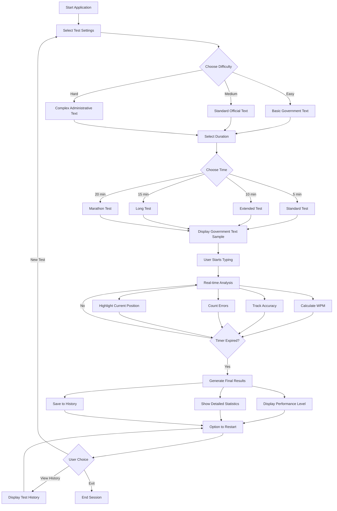

# Government Typing Speed Test



## Overview

A professional typing speed test application designed specifically for government job preparation including SSC CHSL, CGL, Banking, Railway, and other competitive examinations. This application provides realistic practice environment with government-related text samples and standard testing procedures.

## Features

### Core Functionality
- **Real-time Typing Analysis**: Live WPM calculation, accuracy tracking, and error detection
- **Government Exam Durations**: 5, 10, 15, and 20 minute test options
- **Difficulty Levels**: Easy, Medium, and Hard with government-specific text samples
- **Character-by-Character Feedback**: Visual indicators for correct, incorrect, and pending characters
- **Current Word Highlighting**: Dynamic highlighting of the currently typed word

### Government Exam Features
- **SSC Standard Requirements**: Meets SSC CHSL and CGL typing test standards
- **Banking Exam Preparation**: Suitable for clerk and PO typing tests
- **Railway Exam Practice**: Aligned with RRB typing test requirements
- **Performance Classification**: Government job standard assessment levels
- **Test History**: Track progress over multiple practice sessions

### Text Samples
The application includes 8 carefully selected government and administrative text passages:
- Government recruitment information
- Staff Selection Commission details
- Administrative procedures and requirements
- Banking sector examination content
- Railway recruitment information
- Public sector employment guidelines

## Technology Stack

- **Frontend Framework**: React.js (Create React App)
- **Styling**: Pure CSS with simple rectangular design
- **State Management**: React Hooks (useState, useEffect, useRef)
- **Build Tool**: React Scripts
- **Font**: Arial (consistent government document standard)

## Installation

1. Clone the repository:
```bash
git clone <repository-url>
cd typing-speed-test
```

2. Install dependencies:
```bash
npm install
```

3. Start the development server:
```bash
npm start
```

4. Open your browser and navigate to `http://localhost:3000`

## Usage

### Starting a Test
1. Select your preferred test duration (5, 10, 15, or 20 minutes)
2. Choose difficulty level (Easy, Medium, or Hard)
3. Click "Start Test" or begin typing in the text area
4. Type the displayed government text as accurately and quickly as possible

### During the Test
- **Green highlighting**: Correctly typed characters
- **Red highlighting**: Incorrectly typed characters
- **Current position**: Highlighted with blinking cursor
- **Live statistics**: Real-time updates of WPM, accuracy, and errors
- **Progress bar**: Visual indication of remaining time

### After Completion
- View comprehensive results including final WPM and accuracy
- Receive performance classification based on government standards
- Access detailed statistics breakdown
- Review test history for progress tracking

## Government Exam Standards

### SSC Requirements
- **CHSL**: Minimum 35 WPM in English, 30 WPM in Hindi
- **CGL**: Typing proficiency for Data Entry Operator posts
- **Stenographer**: Higher speed requirements for stenographic positions

### Banking Exams
- **Clerk**: Basic typing skills for clerical positions
- **PO**: Administrative typing requirements
- **Specialist Officer**: Technical typing proficiency

### Railway Exams
- **Clerk**: Standard government typing speed
- **Typist**: Professional typing requirements
- **Data Entry**: Accuracy-focused typing skills

### Performance Levels
- **Excellent**: 40+ WPM with 95%+ accuracy (Suitable for all government posts)
- **Good**: 35+ WPM with 90%+ accuracy (Meets most government requirements)
- **Average**: 30+ WPM with 85%+ accuracy (Basic government standard)
- **Needs Improvement**: Below government minimum requirements

## File Structure

```
typing-speed-test/
├── public/
│   └── index.html          # Main HTML template
├── src/
│   ├── App.js              # Main application component
│   ├── App.css             # Application styles
│   ├── index.js            # React DOM rendering
│   └── index.css           # Global styles
├── package.json            # Project dependencies
└── README.md              # Project documentation
```

## Customization

### Adding New Government Text Samples
Edit the `textSamples` array in `App.js` to include additional government-related passages:

```javascript
const textSamples = [
  "Your new government text sample here...",
  // ... existing samples
];
```

### Modifying Difficulty Levels
Adjust the `difficultyLevels` object to change text distribution:

```javascript
const difficultyLevels = {
  easy: textSamples.slice(0, 3),
  medium: textSamples.slice(3, 6),
  hard: textSamples.slice(6, 8)
};
```

### Customizing Time Options
Modify the `timeOptions` array to add or remove test durations:

```javascript
const timeOptions = [300, 600, 900, 1200]; // in seconds (5, 10, 15, 20 minutes)
```

## Browser Compatibility

- Chrome 60+
- Firefox 55+
- Safari 12+
- Edge 79+

## Government Exam Preparation Tips

1. **Regular Practice**: Practice daily for consistent improvement
2. **Accuracy First**: Focus on accuracy before speed
3. **Proper Posture**: Maintain correct sitting posture and finger placement
4. **Time Management**: Practice with actual exam time limits
5. **Error Analysis**: Review and learn from typing mistakes

## Contributing

1. Fork the repository
2. Create a feature branch (`git checkout -b feature/new-feature`)
3. Commit your changes (`git commit -am 'Add new feature'`)
4. Push to the branch (`git push origin feature/new-feature`)
5. Create a Pull Request

## License

This project is open source and available under the MIT License.

## Future Enhancements

- [ ] Hindi typing support for bilingual tests
- [ ] Government job specific text categories
- [ ] Detailed error analysis and improvement suggestions
- [ ] Export test results for exam preparation tracking
- [ ] Offline mode for practice without internet
- [ ] Print-friendly result certificates
- [ ] Voice instructions for accessibility
- [ ] Mobile-responsive design improvements